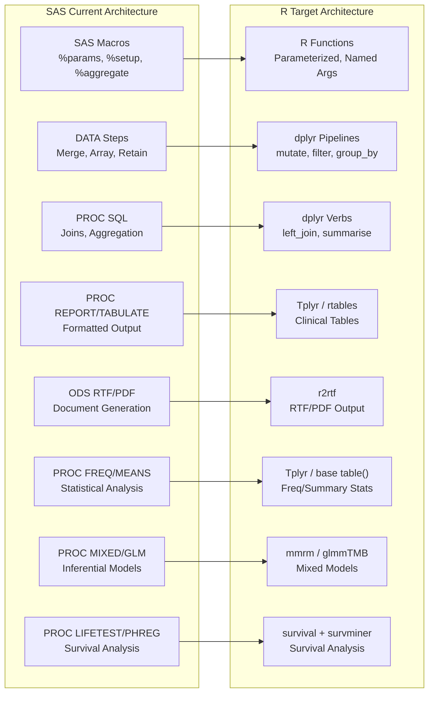

# Technical Specification

# 0. Agent Action Plan

## 0.1 Intent Clarification

### 0.1.1 Core Refactoring Objective

Based on the prompt, the Blitzy platform understands that the refactoring objective is to **migrate an entire repository of SAS clinical reporting scripts** — the PhUSE CS Standard Analyses Working Group (WG5) `phuse-scripts` repository — **to fully operational R programs** suitable for use in a regulated pharmaceutical environment. This is a **tech stack migration** (SAS → R) within the **same repository**, targeting 100% functional parity with the SAS source while producing idiomatic, maintainable R code aligned with industry-standard clinical reporting packages from the pharmaverse ecosystem.

- **Refactoring type**: Tech stack migration (SAS 9.4 → R 4.3+)
- **Target repository**: Same repository — migrated R scripts reside alongside existing SAS source
- **Functional parity**: Every SAS script must produce output numerically equivalent to the documented SAS baseline for at least one production-representative CDISC dataset
- **Idiomatic R**: The migration is NOT a transliteration of SAS syntax into R; each SAS construct must be understood statistically and operationally, then implemented as the correct R equivalent
- **Regulatory compliance**: The migrated R code must be suitable for use in pharmaceutical regulatory submissions (NDA/BLA to FDA, PMDA), with full traceability, rounding audit, and missing value audit

**Implicit requirements surfaced**:
- All SAS macro parameters must become named R function arguments with matching defaults
- All SAS date arithmetic (days from Jan 1, 1960 epoch) must be explicitly handled with `as.Date(x, origin = "1960-01-01")`
- SAS numeric missing (`.`) maps to `NA`; SAS character missing (`' '`) maps to `NA_character_` — no implicit zero substitution permitted
- SAS round-half-up behavior must be explicitly aligned using `janitor::round_half_up()` or justified deviations documented
- No hardcoded file paths — all paths must be parameterized via function arguments or a config object
- Package reproducibility enforced via `renv` lockfile

### 0.1.2 Technical Interpretation

This refactoring translates to the following technical transformation strategy:

- **Current architecture**: A multi-tier SAS ecosystem comprising domain-specific panel drivers (`tested/SAS/`), reusable macro libraries (`whitepapers/utilities/`, `tested/SAS/macros/`, `tested/SAS/ZZ_Utilities/`), WPCT standard figure scripts (`whitepapers/WPCT/`), contributed community scripts (`contributed/`), language-specific experiments (`lang/SAS/`), and data import/derivation utilities — all consuming CDISC ADaM/SDTM datasets via SAS transport (XPT) files
- **Target architecture**: A tidyverse-centric R ecosystem using `haven` for SAS data I/O, `admiral` for ADaM derivations, `Tplyr` for frequency/summary tables, `r2rtf` for RTF/PDF output generation, `mmrm` for FDA-aligned MMRM models, `survival` + `survminer` for survival analysis, and `renv` for reproducible environments — organized into modular R packages with parameterized functions replacing SAS macros
- **Transformation pattern**: Each SAS macro becomes a parameterized R function; each SAS DATA step becomes a dplyr pipeline; each PROC SQL becomes dplyr verbs; each PROC REPORT/TABULATE becomes Tplyr or rtables output; each ODS RTF/PDF becomes r2rtf rendering; each SAS format/informat becomes haven labels and factor levels




## 0.2 Source Analysis

### 0.2.1 Comprehensive Source File Discovery

The PhUSE WG5 `phuse-scripts` repository contains a mature SAS ecosystem spanning 60+ production SAS programs across 6 tested domain panels, 8 WPCT standard scripts, 25+ utility macros, scriptathon archives, and language experiments. The complete source file inventory is organized below by functional category.

**Tested Domain Panels** (`tested/SAS/`) — Production-grade SAS analytics with YAML governance contracts:

| Directory | File | Description |
|-----------|------|-------------|
| `tested/SAS/AE/` | `ae_v1.sas` | Adverse event severity analysis |
| `tested/SAS/AE/` | `ae_v1upd.sas` | AE severity analysis (updated parameterization) |
| `tested/SAS/AE/` | `ae_oncology_v1.sas` | AE oncology-specific analysis |
| `tested/SAS/AE/` | `ae_oncology_v1upd.sas` | AE oncology (updated with richer parameterization) |
| `tested/SAS/AE/` | `ae_v1upd_sas.yml` | YAML governance manifest for AE |
| `tested/SAS/AE/` | `ae_oncology_v1upd_sas.yml` | YAML governance manifest for AE oncology |
| `tested/SAS/DM/` | `demographics_v1.sas` | Demographics: age/race harmonization, disposition merges, multi-domain tabulations, statistical aggregates, Excel exports |
| `tested/SAS/DM/` | `demographics_v1_sas.yml` | YAML governance manifest for demographics |
| `tested/SAS/DS/` | `disposition_v2.sas` | Disposition: run-context globals, %ds_prelim_check, %ds_setup, %ds_by_arm, %time_to_event, %ds_out with JET/PCFILES Excel |
| `tested/SAS/DS/` | `disposition_v2_sas.yml` | YAML governance manifest for disposition |
| `tested/SAS/EX/` | `exposure_v1.sas` | Exposure: retention curves, dose distribution, descriptive stats, planned vs actual, dose changes |
| `tested/SAS/EX/` | `exposure_v1_sas.yml` | YAML governance manifest for exposure |
| `tested/SAS/EX/` | `exposure_exdosfrq.csv` | Dosing frequency lookup reference data |
| `tested/SAS/LB/` | `liver_v2.sas` | Liver lab panel: ALT/AST/ALP/BILI filtering, ULN multiples, DILI metrics, Hy's Law, PCFILES Excel output |
| `tested/SAS/LB/` | `liver_v2_sas.yml` | YAML governance manifest for liver panel |
| `tested/SAS/MedDRA/` | `ae_meddra_w_flag_generation_v1.sas` | Hierarchical SOC/HLGT/HLT/PT risk-difference, relative risk, Fisher's exact, continuity correction |
| `tested/SAS/MedDRA/` | `ae_meddra_w_flag_generation_v1_sas.yml` | YAML governance manifest for MedDRA |
| `tested/SAS/MedDRA/` | `mysdd_ae_meddra_w_flag_generation_v1.sas` | MedDRA branch copy |

**Shared Macros** (`tested/SAS/macros/`) — Reusable analytical macros:

| File | Key SAS Constructs |
|------|-------------------|
| `ae_aggregate.sas` | %ab/%cd macros for MedDRA at-a-glance aggregation |
| `ae_meddra.sas` | %params/%meddra/%meddra_cmp for hierarchical SOC/HLGT/HLT/PT aggregation with RD/RR/Fisher's exact |
| `ae_meddra_output.sas` | Excel worksheet generation for MedDRA hierarchical output |
| `ae_oncology_aggregate.sas` | %aggregate/%compare for oncology AE analysis |
| `ae_oncology_output.sas` | Oncology Excel workbook generation |
| `ae_output.sas` | AE severity Excel XML output |
| `ae_rror.sas` | Odds ratios / relative risks computation |
| `data_checks_disposition.sas` | Disposition domain data validation |
| `data_checks_exposure.sas` | Exposure domain data validation |
| `data_checks_liver.sas` | Liver domain data validation |

**Shared Utilities** (`tested/SAS/ZZ_Utilities/`) — Cross-panel framework macros:

| File | Description |
|------|-------------|
| `ae_setup.sas` | Gatekeeper validation for AE processing |
| `data_checks.sas` | %chk_var/%chk_dm_subj_gt0/%chk_val/%chk_cmp validation macros |
| `err_output.sas` | %error_summary XML error workbook generation |
| `md_output.sas` | Metadata worksheet for Script Launcher |
| `sl_gs_output.sas` | Grouping/subsetting metadata for Script Launcher |
| `xml_output.sas` | SpreadsheetML backbone with style gallery (core output engine) |

**WPCT Standard Scripts** (`whitepapers/WPCT/`) — Central Tendency white paper deliverables:

| File | Description |
|------|-------------|
| `WPCT-F.07.01.sas` | Figure 7.1 — Central tendency boxplot |
| `WPCT-F.07.01-sas92-QCshewhart.sas` | QC Shewhart companion for Figure 7.1 |
| `WPCT-F.07.02.sas` | Figure 7.2 — Central tendency variant |
| `WPCT-F.07.03.sas` | Figure 7.3 — PROC SUMMARY/GLM ANCOVA |
| `WPCT-F.07.04.sas` | Figure 7.4 — Boxplot variation |
| `WPCT-F.07.05.sas` | Figure 7.5 — PROC SGRENDER with PhUSEboxplot GTL |
| `WPCT-F.07.06.sas` | Figure 7.6 — PROC SGRENDER variation |
| `WPCT-F.07.07.sas` | Figure 7.7 — Paginated boxplots |
| `WPCT-F.07.08.sas` | Figure 7.8 — Boxplot with pagination macros |

**Utility Macro Library** (`whitepapers/utilities/`) — 25+ macros in 3 families:

| Family | Key Macros |
|--------|-----------|
| Assert family (8) | `assert_complete_refds.sas`, `assert_dset_exist.sas`, `assert_depend_crumbs.sas`, `assert_var_exist.sas`, `assert_macro_exist.sas`, `assert_rprttest_results.sas`, `assert_unique_keys.sas`, and additional assertion macros |
| Util family (12+) | `util_boxplot_block_ranges.sas`, `util_axis_order.sas`, `util_count_unique_values.sas`, `util_delete_dsets.sas`, `util_get_reference.sas`, `util_get_var_min_max.sas`, `util_labels_from_var.sas`, `util_value_of_macro.sas`, `util_passfail.sas`, `util_proc_template.sas`, `util_resolve_sasautos.sas`, `util_boxplot_visit_ranges.sas` |
| Obsolete (3) | `assert_var_nonmissing.sas`, `obsolete_util_figure_out_label.sas`, `util_figure_out_label_v2.sas` |

**ADaM Derivation Macros** (`whitepapers/ADaM/`):

| File | Description |
|------|-------------|
| `derive_lastminmax_measure.sas` | Reusable macro for ADaM-compliant baseline/post-baseline derivations across LAST/MIN/MAX change modes |

**Language-Specific SAS** (`lang/SAS/`):

| Directory | File | Description |
|-----------|------|-------------|
| `lang/SAS/` | `hello_macro.sas` | Simple hello-world SAS macro |
| `lang/SAS/analysis/UCM072974/src/` | `table7.1.1.1.sas` | Regulatory mortality listing from DM/EX data |
| `lang/SAS/datahandle/` | Define-XML utilities, `SUPP2PAR.sas` macro | Supplemental-to-parent domain merge |
| `lang/SAS/graph/KM/` | `kmplot.sas` | Kaplan-Meier survival curves via PROC LIFETEST |
| `lang/SAS/graph/boxplot/src/` | `BoxplotShewhart_Vst.sas` | Visit-level Shewhart boxplots with change-from-baseline, ANCOVA p-values |
| `lang/SAS/report/` | `doevents.sas` | %doevents macro for event/population merge + PROC REPORT |
| `lang/SAS/report/` | `summary.sas` | %summary with PROC UNIVARIATE/FREQ + comparative tests |
| `lang/SAS/report/sas2xlsx/` | `sas2xlsx.sas` | %sas2xlsx OOXML exporter |

**Contributed Scripts** (`contributed/`):

| Directory | File | Description |
|-----------|------|-------------|
| `contributed/AE/` | Multiple AE scripts | AE severity community contributions |
| `contributed/Demographics/Scripts/` | `demographics.sas` | Monolithic demographics driver |
| `contributed/Demographics/Utility Programs/` | `data_checks.sas`, `err_output.sas`, `sl_gs_output.sas`, `xml_output.sas` | Shared utility copies |
| `contributed/MedDRA/` | MedDRA scripts and utilities | MedDRA community contributions |

**Scriptathon Archives** (`whitepapers/scriptathons/`):

| Directory | Contents |
|-----------|----------|
| `scriptathons/outliers/` | Blood pressure scatter/shift SAS scripts |
| `scriptathons/pk/` | PK mean/overlay/subject concentration plots |
| `scriptathons/ae/` | Common/preferred/serious AE SAS scripts |
| `scriptathons/central/` | Boxplot/mean-time SAS + R scripts |
| `scriptathons/demographics/` | Demographic tables SAS + R scripts |

**Qualification Framework** (`whitepapers/qualification/`):

| Contents | Description |
|----------|-------------|
| 14+ qualification harness scripts | PASS/FAIL validation harnesses for WPCT scripts |

**Root-Level SAS**:

| File | Description |
|------|-------------|
| `Figure_11_1.sas` | Standalone SAS figure script |

### 0.2.2 Existing R Implementations (Migration Reference)

The repository already contains partial R implementations that serve as migration reference patterns:

| File | Description |
|------|-------------|
| `whitepapers/WPCT/WPCT-F.07.01.R` | ggplot2 boxplot for Figure 7.1 |
| `whitepapers/WPCT/WPCT-F.07.02-R-v01.R` | R implementation of Figure 7.2 (v01) |
| `whitepapers/WPCT/WPCT-F.07.02-R-v02.R` | R implementation of Figure 7.2 (v02) |
| `development/R/libs/Func_comm.R` | Config merging, GitHub downloads, Oracle helpers |
| `development/R/libs/TK_functions.R` | XML normalization, SAS transport helpers |
| `development/R/pkgs/phuse/` | phuse R package: manifest crawling, Shiny demos |
| `whitepapers/scriptathons/central/` | Scriptathon R boxplot/mean-time entries |
| `whitepapers/scriptathons/demographics/` | Scriptathon R demographic table entries |

### 0.2.3 Key SAS Technical Patterns Requiring Migration

The following SAS-specific constructs are identified across the source codebase and require targeted migration strategies:

- **PROC SUMMARY / PROC MEANS / PROC UNIVARIATE** — Used extensively in WPCT, DM, EX, LB panels for descriptive statistics
- **PROC GLM** — ANCOVA models in WPCT scripts (Figures 7.3–7.8)
- **PROC FREQ with EXACT FISHER** — MedDRA hierarchical risk analysis, AE severity tables
- **PROC LIFETEST / PROC PHREG** — Kaplan-Meier survival and Cox proportional hazards in `kmplot.sas`, disposition time-to-event
- **PROC MIXED / PROC GLIMMIX** — Mixed model support per user's target stack
- **PROC REPORT / PROC TABULATE** — Demographics, disposition, exposure formatted output
- **PROC SGRENDER / PROC SGPLOT / PROC SHEWHART** — GTL-based graphics with custom PhUSEboxplot template
- **ODS RTF / ODS PDF / ODS HTML** — Document generation across all domain panels
- **SpreadsheetML XML** — Core Excel output engine in `xml_output.sas`
- **PCFILES / JET engine** — Direct Excel writes in disposition, liver panels
- **SAS macro language** — Extensive parameterized macro ecosystem (25+ utility macros, panel-specific macro chains)
- **DATA step merges / hash lookups / BY-group processing** — Fundamental data manipulation across all scripts
- **SAS format/informat system** — Custom format catalogs for CDISC-compliant labels
- **XPORT/XPT transport** — SAS transport file handling for regulatory datasets
- **Continuity correction logic** — Small-sample adjustment in MedDRA Fisher's exact tests


## 0.3 Scope Boundaries

### 0.3.1 Exhaustively In Scope

**Source SAS-to-R transformations** — all SAS programs requiring migration:
- `tested/SAS/**/*.sas` — All 6 tested domain panel drivers and their associated macros
- `tested/SAS/macros/*.sas` — All 10 shared analytical macros
- `tested/SAS/ZZ_Utilities/*.sas` — All 6 shared cross-panel framework macros
- `whitepapers/WPCT/*.sas` — All 8 WPCT standard figure scripts plus QC companion
- `whitepapers/utilities/*.sas` — All 25+ utility macros (assert, util families)
- `whitepapers/ADaM/*.sas` — ADaM derivation macros
- `whitepapers/qualification/**/*.sas` — Qualification harness scripts
- `whitepapers/scriptathons/**/*.sas` — Scriptathon SAS archive entries
- `lang/SAS/**/*.sas` — Language-specific SAS scripts (analysis, graph, report, datahandle)
- `contributed/**/*.sas` — Community contributed SAS scripts and utilities
- `Figure_11_1.sas` — Root-level SAS figure script

**R output programs** — new R files created as migration targets:
- `tested/R/**/*.R` — Migrated domain panel R scripts (AE, DM, DS, EX, LB, MedDRA)
- `tested/R/macros/*.R` — Migrated analytical macros as parameterized R functions
- `tested/R/utilities/*.R` — Migrated cross-panel framework functions
- `whitepapers/WPCT/*.R` — Migrated WPCT standard figure R scripts (extending existing R entries)
- `whitepapers/utilities/R/*.R` — Migrated utility functions
- `whitepapers/ADaM/R/*.R` — ADaM derivation R functions using `admiral`
- `whitepapers/qualification/R/*.R` — R-based qualification harnesses using `testthat`
- `lang/R/**/*.R` — Migrated language-specific R scripts
- `contributed/R/**/*.R` — Migrated contributed R scripts

**Validation deliverables** per the 8-gate validation framework:
- Gate 1: Side-by-side SAS vs R output comparison for every TLF
- Gate 2: Rounding and precision audit documents
- Gate 3: Missing value audit documents
- Gate 4: Model parameter verification documents
- Gate 5: TLF layout verification documents
- Gate 6: `renv.lock` committed and validated
- Gate 7: Scope matching confirmation
- Gate 8: Migration sign-off checklist

**Configuration and infrastructure files**:
- `renv.lock` — Package reproducibility lockfile (new)
- `renv/` — renv library directory (new)
- `.Rprofile` — R environment configuration (new)
- `config/*.yaml` — Parameterized path configuration replacing hardcoded SAS paths (new or updated)

**Documentation updates**:
- `README.md` — Update with R migration instructions, R setup guidance
- `docs/**/*.md` — Update all documentation references for R equivalents
- `whitepapers/CentralTendency-UserGuide.md` — Update WPCT user guide for R scripts
- `whitepapers/ProgrammingGuidelines.md` — Add R programming guidelines
- YAML governance manifests (`**/*_sas.yml`) — Create corresponding R manifests

**Test updates**:
- `tests/**/*.R` — R test files using `testthat` framework
- `tests/testthat/**/*.R` — Unit tests for migrated functions
- `tests/validation/**/*.R` — Validation gate test scripts

**MIGRATION NOTES blocks** — appended to every migrated R script per user specification:
- Assumptions made where SAS behavior was ambiguous
- Locations where R and SAS may produce numerically different results
- SAS functionality with no direct R equivalent and approved workaround
- Packages selected and rationale
- Open questions requiring statistician review

### 0.3.2 Explicitly Out of Scope

Per user specification, the following items are **explicitly out of scope**:

- **ADaM dataset specifications** — The user has no authority over ADaM dataset specifications; migration handles derivation code only
- **SAP amendments** — Statistical Analysis Plan amendments are outside the migration architect's authority
- **Regulatory submission strategy** — Decisions about regulatory filing approach are outside migration scope
- **External vendor interface contracts** — Vendor-facing specifications are excluded
- **Adding statistical functionality** — No statistical functionality beyond what each SAS script implements shall be added
- **SAS source file reproduction** — SAS source files are NOT reproduced in the R output; the traceability matrix references originals by filename and version header
- **SAS runtime dependency** — All validation runs against a local R environment with no gate requiring access to a SAS runtime or production environment
- **Base R equivalents when tidyverse exists** — Base R must not be used when a tidyverse function exists and is appropriate
- **lme4/nlme/glmer for MMRM** — These packages must not be used for models where `mmrm` applies
- **Implicit zero substitution** — Missing values must never be assumed as zero
- **Non-CDISC data handling** — Only CDISC ADaM/SDTM compliant datasets are within scope
- **Julia, PL/SQL, HTML/JS components** — `lang/Julia/`, `lang/PL_SQL/`, `lang/HTML/` directories are non-SAS and remain untouched


## 0.4 Target Design

### 0.4.1 Refactored Structure Planning

The target R architecture mirrors the SAS organizational hierarchy while following idiomatic R project conventions. Every migrated R file is placed in a parallel R directory structure adjacent to the SAS originals, maintaining traceability.

```
Target:
phuse-scripts/
├── .Rprofile                          (NEW - renv bootstrap)
├── renv.lock                          (NEW - package lockfile)
├── renv/                              (NEW - renv library)
├── config/
│   └── migration_config.yaml          (NEW - parameterized paths, study-level settings)
│
├── tested/
│   ├── R/
│   │   ├── AE/
│   │   │   ├── ae_v1.R               (migrated from tested/SAS/AE/ae_v1.sas)
│   │   │   ├── ae_v1upd.R            (migrated from tested/SAS/AE/ae_v1upd.sas)
│   │   │   ├── ae_oncology_v1.R      (migrated from tested/SAS/AE/ae_oncology_v1.sas)
│   │   │   ├── ae_oncology_v1upd.R   (migrated from tested/SAS/AE/ae_oncology_v1upd.sas)
│   │   │   └── ae_v1upd_r.yml        (NEW - R governance manifest)
│   │   ├── DM/
│   │   │   ├── demographics_v1.R     (migrated from tested/SAS/DM/demographics_v1.sas)
│   │   │   └── demographics_v1_r.yml (NEW - R governance manifest)
│   │   ├── DS/
│   │   │   ├── disposition_v2.R      (migrated from tested/SAS/DS/disposition_v2.sas)
│   │   │   └── disposition_v2_r.yml  (NEW - R governance manifest)
│   │   ├── EX/
│   │   │   ├── exposure_v1.R         (migrated from tested/SAS/EX/exposure_v1.sas)
│   │   │   └── exposure_v1_r.yml     (NEW - R governance manifest)
│   │   ├── LB/
│   │   │   ├── liver_v2.R            (migrated from tested/SAS/LB/liver_v2.sas)
│   │   │   └── liver_v2_r.yml        (NEW - R governance manifest)
│   │   ├── MedDRA/
│   │   │   ├── ae_meddra_w_flag_generation_v1.R  (migrated)
│   │   │   └── ae_meddra_v1_r.yml    (NEW - R governance manifest)
│   │   ├── macros/
│   │   │   ├── ae_aggregate.R        (migrated from tested/SAS/macros/ae_aggregate.sas)
│   │   │   ├── ae_meddra.R           (migrated from tested/SAS/macros/ae_meddra.sas)
│   │   │   ├── ae_meddra_output.R    (migrated)
│   │   │   ├── ae_oncology_aggregate.R  (migrated)
│   │   │   ├── ae_oncology_output.R  (migrated)
│   │   │   ├── ae_output.R           (migrated)
│   │   │   ├── ae_rror.R             (migrated)
│   │   │   ├── data_checks_disposition.R  (migrated)
│   │   │   ├── data_checks_exposure.R     (migrated)
│   │   │   └── data_checks_liver.R        (migrated)
│   │   └── utilities/
│   │       ├── ae_setup.R            (migrated from tested/SAS/ZZ_Utilities/ae_setup.sas)
│   │       ├── data_checks.R         (migrated)
│   │       ├── err_output.R          (migrated)
│   │       ├── md_output.R           (migrated)
│   │       ├── sl_gs_output.R        (migrated)
│   │       └── xml_output.R          (migrated - SpreadsheetML → openxlsx/r2rtf)
│   └── SAS/                           (UNCHANGED - original SAS scripts preserved)
│
├── whitepapers/
│   ├── WPCT/
│   │   ├── WPCT-F.07.01.R            (UPDATE - extend existing R implementation)
│   │   ├── WPCT-F.07.02.R            (UPDATE - consolidate v01/v02 into canonical)
│   │   ├── WPCT-F.07.03.R            (NEW - migrated from SAS)
│   │   ├── WPCT-F.07.04.R            (NEW - migrated from SAS)
│   │   ├── WPCT-F.07.05.R            (NEW - migrated from SAS)
│   │   ├── WPCT-F.07.06.R            (NEW - migrated from SAS)
│   │   ├── WPCT-F.07.07.R            (NEW - migrated from SAS)
│   │   └── WPCT-F.07.08.R            (NEW - migrated from SAS)
│   ├── utilities/
│   │   └── R/
│   │       ├── assert_complete_refds.R     (migrated)
│   │       ├── assert_dset_exist.R         (migrated)
│   │       ├── assert_depend_crumbs.R      (migrated)
│   │       ├── assert_var_exist.R          (migrated)
│   │       ├── assert_macro_exist.R        (migrated → assert_function_exist.R)
│   │       ├── util_boxplot_block_ranges.R (migrated)
│   │       ├── util_axis_order.R           (migrated)
│   │       ├── util_count_unique_values.R  (migrated)
│   │       ├── util_delete_dsets.R         (migrated → cleanup utility)
│   │       ├── util_get_reference.R        (migrated)
│   │       ├── util_get_var_min_max.R      (migrated)
│   │       ├── util_labels_from_var.R      (migrated)
│   │       ├── util_value_of_macro.R       (migrated → util_value_of_param.R)
│   │       ├── util_passfail.R             (migrated)
│   │       ├── util_proc_template.R        (migrated → util_ggplot_theme.R)
│   │       └── util_boxplot_visit_ranges.R (migrated)
│   ├── ADaM/
│   │   └── R/
│   │       └── derive_lastminmax_measure.R (migrated using admiral functions)
│   ├── qualification/
│   │   └── R/
│   │       └── qualification_harnesses.R   (migrated using testthat)
│   └── scriptathons/
│       └── R/
│           ├── outliers/               (migrated scriptathon entries)
│           ├── pk/                     (migrated scriptathon entries)
│           ├── ae/                     (migrated scriptathon entries)
│           ├── central/                (migrated scriptathon entries)
│           └── demographics/           (migrated scriptathon entries)
│
├── lang/
│   └── R/
│       ├── analysis/
│       │   └── table7.1.1.1.R         (migrated from lang/SAS/analysis/)
│       ├── graph/
│       │   ├── kmplot.R               (migrated from lang/SAS/graph/KM/)
│       │   └── boxplot_shewhart.R     (migrated from lang/SAS/graph/boxplot/)
│       └── report/
│           ├── doevents.R             (migrated from lang/SAS/report/)
│           ├── summary.R             (migrated from lang/SAS/report/)
│           └── write_xlsx.R           (migrated from sas2xlsx)
│
├── contributed/
│   └── R/
│       ├── AE/                        (migrated community AE scripts)
│       ├── Demographics/              (migrated demographics driver)
│       └── MedDRA/                    (migrated MedDRA scripts)
│
├── tests/
│   ├── testthat/
│   │   ├── test_ae_aggregate.R        (unit tests for migrated AE macros)
│   │   ├── test_demographics.R        (unit tests for DM panel)
│   │   ├── test_disposition.R         (unit tests for DS panel)
│   │   ├── test_exposure.R            (unit tests for EX panel)
│   │   ├── test_liver.R               (unit tests for LB panel)
│   │   ├── test_meddra.R             (unit tests for MedDRA panel)
│   │   ├── test_wpct_figures.R        (unit tests for WPCT scripts)
│   │   └── test_utilities.R           (unit tests for utility functions)
│   └── validation/
│       ├── gate1_functional_parity.R  (output parity validation)
│       ├── gate2_rounding_audit.R     (rounding/precision audit)
│       ├── gate3_missing_value_audit.R (missing value audit)
│       ├── gate4_model_parameters.R   (inferential model verification)
│       ├── gate5_tlf_layout.R         (TLF layout verification)
│       └── gate7_scope_matching.R     (scope matching confirmation)
│
└── docs/
    ├── migration_traceability.md      (NEW - SAS-to-R traceability matrix)
    └── validation_report.md           (NEW - validation gate results)
```

### 0.4.2 Web Search Research Conducted

Research was conducted to verify current package versions, best practices, and migration strategies:

- **admiral package** (pharmaverse): Verified at version 1.3.0 on CRAN. Provides CDISC ADaM derivation functions with modular, composable design. Used by pharmaceutical companies for FDA/EMA filings.
- **Tplyr package** (Atorus Research): Verified at version 1.2.1 on CRAN. Provides traceability-focused clinical summary grammar with PHUSE-referenced standard output designs.
- **mmrm package** (openpharma): Verified at version 0.3.17 on CRAN. Implements MMRM based on marginal linear model using TMB, supporting Satterthwaite and Kenward-Roger df adjustments, 10 covariance structures.
- **r2rtf package** (Merck): Verified at version 1.1.1 on CRAN. Production-ready RTF table/figure output with chainable verb functions.
- **haven package** (tidyverse): Verified at version 2.5.5 on CRAN. SAS7BDAT/SAS7BCAT/XPT reader/writer via embedded ReadStat C library.
- **SAS-to-R migration best practices**: pharmaverse ecosystem provides end-to-end clinical reporting workflow aligned with CDISC standards and regulatory requirements

### 0.4.3 Design Pattern Applications

- **Parameterized function pattern** replacing SAS macros: Every `%macro name(param1=default1, param2=default2)` becomes `name <- function(param1 = default1, param2 = default2)` with named arguments and matching defaults
- **Pipeline pattern** replacing DATA steps: SAS DATA step sequences become `%>%` (or `|>`) dplyr chains with `mutate()`, `filter()`, `arrange()`, `group_by()`, `summarise()`
- **Configuration object pattern** replacing hardcoded paths: A centralized `config.yaml` or R list object holds all study paths, parameters, and settings
- **Assertion function pattern** replacing SAS assert macros: `assert_*()` functions using `stopifnot()`, `cli::cli_abort()`, or custom validation with informative error messages
- **Factory pattern** for output generation: Parameterized RTF/PDF generators using `r2rtf` pipelines that accept data frames and formatting specifications
- **Traceability pattern** using Tplyr metadata: Every summary result maintains a link to its source data via Tplyr's built-in traceability metadata system


## 0.5 Transformation Mapping

### 0.5.1 File-by-File Transformation Plan

Every target file is mapped to its source file(s) with explicit transformation mode and key changes. The entire migration is executed in **one phase**.

**Tested Domain Panel Drivers:**

| Target File | Transformation | Source File | Key Changes |
|------------|----------------|-------------|-------------|
| `tested/R/AE/ae_v1.R` | CREATE | `tested/SAS/AE/ae_v1.sas` | AE severity analysis: DATA step → dplyr pipeline; PROC FREQ → Tplyr count layer; SpreadsheetML → r2rtf/openxlsx; all macro params → function args |
| `tested/R/AE/ae_v1upd.R` | CREATE | `tested/SAS/AE/ae_v1upd.sas` | Updated AE severity: richer parameterization preserved; PROC FREQ EXACT FISHER → fisher.test(); format catalogs → haven labels |
| `tested/R/AE/ae_oncology_v1.R` | CREATE | `tested/SAS/AE/ae_oncology_v1.sas` | Oncology AE: %aggregate/%compare macros → R functions; Excel XML → openxlsx workbook |
| `tested/R/AE/ae_oncology_v1upd.R` | CREATE | `tested/SAS/AE/ae_oncology_v1upd.sas` | Updated oncology AE: extended parameterization; all macro chains → function composition |
| `tested/R/DM/demographics_v1.R` | CREATE | `tested/SAS/DM/demographics_v1.sas` | Demographics: age/race harmonization → dplyr mutate/case_when; PROC SUMMARY → Tplyr desc layer; PROC REPORT → Tplyr + r2rtf; disposition merges → left_join; Excel → openxlsx |
| `tested/R/DS/disposition_v2.R` | CREATE | `tested/SAS/DS/disposition_v2.sas` | Disposition: %ds_prelim_check → R assertion function; %ds_by_arm → group_by + summarise; %time_to_event → survival::Surv + survfit; JET/PCFILES → openxlsx; %ds_out → r2rtf |
| `tested/R/EX/exposure_v1.R` | CREATE | `tested/SAS/EX/exposure_v1.sas` | Exposure: 5 analyses (retention, dose dist, desc stats, planned vs actual, dose changes) → dplyr pipelines + ggplot2; PROC LIFETEST retention → survival::survfit; PROC MEANS → Tplyr |
| `tested/R/LB/liver_v2.R` | CREATE | `tested/SAS/LB/liver_v2.sas` | Liver: ALT/AST/ALP/BILI filtering → dplyr filter; ULN multiples → mutate(x / uln); DILI/Hy's Law → admiral-style derivations; PCFILES → openxlsx |
| `tested/R/MedDRA/ae_meddra_w_flag_generation_v1.R` | CREATE | `tested/SAS/MedDRA/ae_meddra_w_flag_generation_v1.sas` | MedDRA: SOC/HLGT/HLT/PT hierarchy → nested group_by; risk-difference → prop.test or Tplyr; Fisher's exact → fisher.test with continuity correction; PROC FREQ → Tplyr count layer |

**Tested Shared Macros — Migrated as Parameterized R Functions:**

| Target File | Transformation | Source File | Key Changes |
|------------|----------------|-------------|-------------|
| `tested/R/macros/ae_aggregate.R` | CREATE | `tested/SAS/macros/ae_aggregate.sas` | %ab/%cd macros → R functions; MedDRA at-a-glance aggregation → dplyr group_by + summarise |
| `tested/R/macros/ae_meddra.R` | CREATE | `tested/SAS/macros/ae_meddra.sas` | %params/%meddra/%meddra_cmp → 3 R functions; hierarchical aggregation → nested dplyr; RD/RR → epitools or manual calc |
| `tested/R/macros/ae_meddra_output.R` | CREATE | `tested/SAS/macros/ae_meddra_output.sas` | Excel worksheet generation → openxlsx::addWorksheet pipeline |
| `tested/R/macros/ae_oncology_aggregate.R` | CREATE | `tested/SAS/macros/ae_oncology_aggregate.sas` | %aggregate/%compare → R functions; oncology AE logic preserved |
| `tested/R/macros/ae_oncology_output.R` | CREATE | `tested/SAS/macros/ae_oncology_output.sas` | Oncology Excel workbook → openxlsx pipeline |
| `tested/R/macros/ae_output.R` | CREATE | `tested/SAS/macros/ae_output.sas` | AE severity Excel XML → openxlsx or r2rtf output |
| `tested/R/macros/ae_rror.R` | CREATE | `tested/SAS/macros/ae_rror.sas` | Odds ratios/relative risks → epitools::riskratio or manual fisher.test-based computation |
| `tested/R/macros/data_checks_disposition.R` | CREATE | `tested/SAS/macros/data_checks_disposition.sas` | Disposition data checks → R validation functions with tryCatch |
| `tested/R/macros/data_checks_exposure.R` | CREATE | `tested/SAS/macros/data_checks_exposure.sas` | Exposure data checks → R validation functions |
| `tested/R/macros/data_checks_liver.R` | CREATE | `tested/SAS/macros/data_checks_liver.sas` | Liver data checks → R validation functions |

**Tested Shared Utilities — Framework Functions:**

| Target File | Transformation | Source File | Key Changes |
|------------|----------------|-------------|-------------|
| `tested/R/utilities/ae_setup.R` | CREATE | `tested/SAS/ZZ_Utilities/ae_setup.sas` | Gatekeeper validation → R assertion chain with informative errors |
| `tested/R/utilities/data_checks.R` | CREATE | `tested/SAS/ZZ_Utilities/data_checks.sas` | %chk_var/%chk_dm_subj_gt0/%chk_val/%chk_cmp → R check functions |
| `tested/R/utilities/err_output.R` | CREATE | `tested/SAS/ZZ_Utilities/err_output.sas` | %error_summary XML → openxlsx error workbook or tibble summary |
| `tested/R/utilities/md_output.R` | CREATE | `tested/SAS/ZZ_Utilities/md_output.sas` | Metadata worksheet → tibble/openxlsx metadata output |
| `tested/R/utilities/sl_gs_output.R` | CREATE | `tested/SAS/ZZ_Utilities/sl_gs_output.sas` | Grouping/subsetting metadata → R list/tibble structure |
| `tested/R/utilities/xml_output.R` | CREATE | `tested/SAS/ZZ_Utilities/xml_output.sas` | SpreadsheetML backbone → openxlsx workbook pipeline with style gallery |

**WPCT Standard Figures:**

| Target File | Transformation | Source File | Key Changes |
|------------|----------------|-------------|-------------|
| `whitepapers/WPCT/WPCT-F.07.01.R` | UPDATE | `whitepapers/WPCT/WPCT-F.07.01.R` + `WPCT-F.07.01.sas` | Extend existing R boxplot to full parity with SAS; verify ggplot2 output matches PROC SGRENDER; add MIGRATION NOTES |
| `whitepapers/WPCT/WPCT-F.07.02.R` | UPDATE | `whitepapers/WPCT/WPCT-F.07.02-R-v01.R` + `WPCT-F.07.02.sas` | Consolidate v01/v02 into canonical; verify parity |
| `whitepapers/WPCT/WPCT-F.07.03.R` | CREATE | `whitepapers/WPCT/WPCT-F.07.03.sas` | PROC GLM ANCOVA → stats::aov or car::Anova; PROC SUMMARY → dplyr; PROC SGRENDER → ggplot2 |
| `whitepapers/WPCT/WPCT-F.07.04.R` | CREATE | `whitepapers/WPCT/WPCT-F.07.04.sas` | Boxplot variant → ggplot2::geom_boxplot with reference lines |
| `whitepapers/WPCT/WPCT-F.07.05.R` | CREATE | `whitepapers/WPCT/WPCT-F.07.05.sas` | PhUSEboxplot GTL template → custom ggplot2 theme + geom_boxplot |
| `whitepapers/WPCT/WPCT-F.07.06.R` | CREATE | `whitepapers/WPCT/WPCT-F.07.06.sas` | PROC SGRENDER variation → ggplot2 + gridExtra/patchwork |
| `whitepapers/WPCT/WPCT-F.07.07.R` | CREATE | `whitepapers/WPCT/WPCT-F.07.07.sas` | Paginated boxplots → ggplot2 + facet_wrap or manual page splitting |
| `whitepapers/WPCT/WPCT-F.07.08.R` | CREATE | `whitepapers/WPCT/WPCT-F.07.08.sas` | Pagination macros → R pagination function + ggplot2 |

**Utility Macro Library (representative set):**

| Target File | Transformation | Source File | Key Changes |
|------------|----------------|-------------|-------------|
| `whitepapers/utilities/R/assert_complete_refds.R` | CREATE | `whitepapers/utilities/assert_complete_refds.sas` | SAS assertion → R stopifnot/cli_abort check |
| `whitepapers/utilities/R/assert_dset_exist.R` | CREATE | `whitepapers/utilities/assert_dset_exist.sas` | Dataset existence → file.exists() or object check |
| `whitepapers/utilities/R/assert_var_exist.R` | CREATE | `whitepapers/utilities/assert_var_exist.sas` | Variable existence → colnames check |
| `whitepapers/utilities/R/util_boxplot_block_ranges.R` | CREATE | `whitepapers/utilities/util_boxplot_block_ranges.sas` | Block range calc → R numeric computation |
| `whitepapers/utilities/R/util_axis_order.R` | CREATE | `whitepapers/utilities/util_axis_order.sas` | Axis ordering → R factor level + scale manipulation |
| `whitepapers/utilities/R/util_passfail.R` | CREATE | `whitepapers/utilities/util_passfail.sas` | PASS/FAIL testing → testthat expect_* wrappers |
| `whitepapers/utilities/R/util_proc_template.R` | CREATE | `whitepapers/utilities/util_proc_template.sas` | PhUSEboxplot GTL registration → ggplot2 theme_phuse() |
| `whitepapers/utilities/R/util_get_reference.R` | CREATE | `whitepapers/utilities/util_get_reference.sas` | Reference line data → R tibble getter |
| `whitepapers/utilities/R/util_boxplot_visit_ranges.R` | CREATE | `whitepapers/utilities/util_boxplot_visit_ranges.sas` | Visit range calc → R date/visit computation |

**Lang/SAS Migrations:**

| Target File | Transformation | Source File | Key Changes |
|------------|----------------|-------------|-------------|
| `lang/R/analysis/table7.1.1.1.R` | CREATE | `lang/SAS/analysis/UCM072974/src/table7.1.1.1.sas` | Regulatory mortality listing: DATA step merge → dplyr left_join; PROC REPORT → Tplyr + r2rtf |
| `lang/R/graph/kmplot.R` | CREATE | `lang/SAS/graph/KM/kmplot.sas` | Kaplan-Meier: PROC LIFETEST → survival::survfit; PROC SGPLOT → survminer::ggsurvplot; ties/strat preserved |
| `lang/R/graph/boxplot_shewhart.R` | CREATE | `lang/SAS/graph/boxplot/src/BoxplotShewhart_Vst.sas` | Shewhart boxplots: PROC SHEWHART → ggplot2 geom_boxplot; change-from-baseline → dplyr; ANCOVA p-values → car::Anova |
| `lang/R/report/doevents.R` | CREATE | `lang/SAS/report/doevents.sas` | %doevents: event/population merge → dplyr; PROC REPORT → Tplyr + r2rtf |
| `lang/R/report/summary.R` | CREATE | `lang/SAS/report/summary.sas` | %summary: PROC UNIVARIATE → dplyr summarise; PROC FREQ → Tplyr; comparative tests → t.test/wilcox.test |
| `lang/R/report/write_xlsx.R` | CREATE | `lang/SAS/report/sas2xlsx/sas2xlsx.sas` | %sas2xlsx OOXML → openxlsx::write.xlsx pipeline |

**ADaM Derivation:**

| Target File | Transformation | Source File | Key Changes |
|------------|----------------|-------------|-------------|
| `whitepapers/ADaM/R/derive_lastminmax_measure.R` | CREATE | `whitepapers/ADaM/derive_lastminmax_measure.sas` | ADaM derivation macro → admiral::derive_var_extreme_flag + dplyr; LAST/MIN/MAX modes → admiral patterns |

**Infrastructure and Configuration:**

| Target File | Transformation | Source File | Key Changes |
|------------|----------------|-------------|-------------|
| `renv.lock` | CREATE | (none — new) | Pin all R packages with exact versions for reproducibility |
| `.Rprofile` | CREATE | (none — new) | renv bootstrap: `source("renv/activate.R")` |
| `config/migration_config.yaml` | CREATE | (none — new) | Parameterized paths, study settings, output directories |
| `README.md` | UPDATE | `README.md` | Add R migration instructions, setup guidance, package requirements |
| `whitepapers/ProgrammingGuidelines.md` | UPDATE | `whitepapers/ProgrammingGuidelines.md` | Add R programming guidelines alongside SAS guidelines |

**Validation Gate Scripts:**

| Target File | Transformation | Source File | Key Changes |
|------------|----------------|-------------|-------------|
| `tests/validation/gate1_functional_parity.R` | CREATE | (none — new) | Automated SAS vs R output comparison |
| `tests/validation/gate2_rounding_audit.R` | CREATE | (none — new) | Rounding difference detection and documentation |
| `tests/validation/gate3_missing_value_audit.R` | CREATE | (none — new) | Missing value handling verification |
| `tests/validation/gate4_model_parameters.R` | CREATE | (none — new) | Model covariance, df method, optimizer verification |
| `tests/validation/gate5_tlf_layout.R` | CREATE | (none — new) | TLF title/footnote/header/indentation comparison |
| `tests/validation/gate7_scope_matching.R` | CREATE | (none — new) | Confirm no added/removed functionality |

### 0.5.2 Cross-File Dependencies

**Import statement transformations** — representative examples of how SAS internal references become R library/source calls:

- FROM: `%include "&macros_path/ae_aggregate.sas";`
- TO: `source("tested/R/macros/ae_aggregate.R")` or package-based `library(phuse)` call

- FROM: `%include "&utilities_path/data_checks.sas";`
- TO: `source("tested/R/utilities/data_checks.R")`

- FROM: `%include "&wp_utils/util_passfail.sas";`
- TO: `source("whitepapers/utilities/R/util_passfail.R")`

- FROM: `libname adam "&data_path" access=readonly;`
- TO: `adam_data <- haven::read_xpt(file.path(config$data_path, "adsl.xpt"))`

- FROM: `proc import datafile="&csv_path/exposure_exdosfrq.csv" ...;`
- TO: `exdosfrq <- readr::read_csv(file.path(config$csv_path, "exposure_exdosfrq.csv"))`

**Configuration updates for new structure:**
- All `%let` global macro variables → entries in `config/migration_config.yaml`
- All `libname` statements → `haven::read_xpt()` / `haven::read_sas()` calls with config paths
- All `ods` destination statements → `r2rtf::write_rtf()` with config output paths

### 0.5.3 Wildcard Patterns

Wildcard patterns are used sparingly and only with trailing patterns:

- `tested/R/**/*.R` — All migrated tested domain R scripts
- `tested/R/macros/*.R` — All migrated macro R functions
- `tested/R/utilities/*.R` — All migrated utility R functions
- `whitepapers/WPCT/*.R` — All WPCT R scripts (new and updated)
- `whitepapers/utilities/R/*.R` — All migrated utility R functions
- `tests/testthat/*.R` — All unit test files
- `tests/validation/*.R` — All validation gate scripts

### 0.5.4 One-Phase Execution

The entire SAS-to-R migration is executed by Blitzy in **ONE phase**. All files listed above — domain panels, macros, utilities, WPCT scripts, lang scripts, contributed scripts, ADaM derivations, infrastructure, validation scripts, and documentation — are created or updated in a single execution pass. There is no phased rollout or incremental migration strategy.


## 0.6 Dependency Inventory

### 0.6.1 Key Private and Public Packages

All packages listed below are from CRAN (public registry) unless otherwise noted. Versions are verified against CRAN as of March 2026.

**Core Target Stack (User-Specified):**

| Registry | Package | Version | Purpose |
|----------|---------|---------|---------|
| CRAN | R | >= 4.3.0 | Runtime — user specifies R 4.3+ |
| CRAN | dplyr | >= 1.1.0 | Core tidyverse: data manipulation replacing DATA steps and PROC SQL |
| CRAN | tidyr | >= 1.3.0 | Core tidyverse: pivoting, nesting, reshaping |
| CRAN | purrr | >= 1.0.0 | Core tidyverse: functional programming, replacing SAS arrays/macro loops |
| CRAN | stringr | >= 1.5.0 | Core tidyverse: string manipulation replacing SAS character functions |
| CRAN | lubridate | >= 1.9.0 | Core tidyverse: date/time handling replacing SAS date math |
| CRAN | forcats | >= 1.0.0 | Core tidyverse: factor manipulation replacing SAS format ordering |
| CRAN | haven | 2.5.5 | Data I/O: read_sas(), read_xpt(), write_xpt() for SAS datasets |
| CRAN | readr | >= 2.1.0 | Data I/O: flat files (CSV, delimited) |
| CRAN | admiral | 1.3.0 | ADaM derivations: CDISC-compliant analysis dataset creation |
| CRAN | Tplyr | 1.2.1 | Table outputs: frequency/summary tables with denominators and traceability |
| CRAN | r2rtf | 1.1.1 | RTF/PDF output: ODS RTF/PDF equivalent with column widths, titles, footnotes |
| CRAN | mmrm | 0.3.17 | Mixed models: FDA-aligned MMRM with Satterthwaite/Kenward-Roger df methods |
| CRAN | survival | >= 3.5-0 | Survival analysis: Surv(), survfit(), coxph() replacing PROC LIFETEST/PHREG |
| CRAN | survminer | >= 0.4.9 | Survival visualization: ggsurvplot() replacing SAS KM plots |
| CRAN | renv | >= 1.0.0 | Environment: package reproducibility via lockfile |

**Supplementary Analytical Packages:**

| Registry | Package | Version | Purpose |
|----------|---------|---------|---------|
| CRAN | ggplot2 | >= 3.4.0 | Visualization: replacing PROC SGPLOT/SGRENDER/SHEWHART |
| CRAN | gridExtra | >= 2.3 | Plot arrangement: multi-panel figure layouts |
| CRAN | patchwork | >= 1.2.0 | Advanced plot composition (alternative to gridExtra) |
| CRAN | car | >= 3.1-0 | ANOVA: Type II/III tests for ANCOVA replacing PROC GLM |
| CRAN | emmeans | >= 1.8.0 | LS means: estimated marginal means for MMRM and GLM models |
| CRAN | janitor | >= 2.2.0 | round_half_up(): SAS-compatible rounding behavior |
| CRAN | gt | >= 0.10.0 | Table rendering alternative for complex nested layouts |
| CRAN | openxlsx | >= 4.2.5 | Excel output: replacing SpreadsheetML XML and PCFILES engine |
| CRAN | tibble | >= 3.2.0 | Enhanced data frames for clinical data |
| CRAN | cli | >= 3.6.0 | User-facing messages and error formatting |

**Validation and Testing Packages:**

| Registry | Package | Version | Purpose |
|----------|---------|---------|---------|
| CRAN | testthat | >= 3.2.0 | Unit testing framework replacing SAS qualification harnesses |
| CRAN | diffdf | >= 1.0.4 | Data frame comparison for SAS vs R output parity (Gate 1) |
| CRAN | withr | >= 2.5.0 | Temporary state management for reproducible tests |

**Existing Repository R Packages (already in use):**

| Registry | Package | Version | Purpose |
|----------|---------|---------|---------|
| CRAN | data.table | >= 1.14.0 | High-performance data manipulation (used in existing R scripts) |
| CRAN | Hmisc | >= 5.1-0 | Statistical utilities (used in existing WPCT R scripts) |
| CRAN | yaml | >= 2.3.0 | YAML config parsing (used in development/R/) |
| CRAN | tools | (base) | R base utilities (used in existing R scripts) |

### 0.6.2 Dependency Updates

**Import Refactoring** — all migrated R files require consistent library loading:

Files requiring import updates (trailing wildcard patterns):
- `tested/R/**/*.R` — Load haven, dplyr, tidyr, Tplyr, r2rtf, openxlsx
- `whitepapers/WPCT/*.R` — Load haven, dplyr, ggplot2, gridExtra, car (for ANCOVA scripts)
- `whitepapers/utilities/R/*.R` — Load dplyr, rlang, cli (for utility functions)
- `tests/testthat/*.R` — Load testthat, diffdf, haven
- `tests/validation/*.R` — Load testthat, diffdf, haven, janitor

**Import transformation rules:**

- Old (SAS): `%include "&path/macro_name.sas";`
- New (R): `source(file.path(config$r_macros_path, "macro_name.R"))` or `library(phuse)`
- Apply to: All files matching `tested/R/**/*.R`, `whitepapers/**/*.R`

- Old (SAS): `libname adam "&adam_path" access=readonly;`
- New (R): `adsl <- haven::read_xpt(file.path(config$adam_path, "adsl.xpt"))`
- Apply to: All domain panel drivers

- Old (SAS): `ods rtf file="&output_path/report.rtf";`
- New (R): `write_rtf(tbl, file = file.path(config$output_path, "report.rtf"))`
- Apply to: All output-producing scripts

**External Reference Updates:**

| Pattern | Update Required |
|---------|----------------|
| `config/*.yaml` | Add R-specific configuration sections |
| `**/*.yml` | Create R governance manifests alongside SAS manifests |
| `README.md` | Add R setup instructions, renv restore guidance |
| `whitepapers/ProgrammingGuidelines.md` | Add R coding standards |
| `.Rprofile` | renv bootstrap activation |
| `renv.lock` | Pin all packages with exact versions |


## 0.7 Special Analysis

### 0.7.1 SAS-to-R Construct Mapping Semantics

The user has specified a comprehensive SAS-to-R mapping table. This section provides an in-depth analysis of each mapping, identifying the specific repository files impacted and the critical semantic preservation requirements.

**DATA Step → dplyr Pipelines**

SAS DATA steps appear throughout the repository in every domain panel driver and utility macro. The critical semantic to preserve is the PDV (Program Data Vector) processing model — SAS processes row-by-row with implicit retain behavior, automatic initialization of new variables to missing, and set/merge operations with BY-group interleaving.

- **RETAIN statement** → `purrr::accumulate()` or explicit group-level logic via `dplyr::lag()` / `dplyr::lead()`
- **Array processing** → `purrr::map()` / `across()` operations
- **BY-group processing** → `dplyr::group_by() + arrange()` — sort order MUST be established before grouping to match SAS BY statement semantics
- **SET/MERGE** → `dplyr::left_join()`, `inner_join()`, `bind_rows()` — join type must match SAS merge behavior (many-to-many, one-to-many)
- **Affected files**: All files in `tested/SAS/**/*.sas`, `whitepapers/**/*.sas`, `lang/SAS/**/*.sas`, `contributed/**/*.sas`

**PROC SQL → dplyr Verbs**

PROC SQL is used for complex joins, subqueries, and aggregations across the repository. Key semantic preservation: SAS PROC SQL allows re-merging summary statistics back to detail rows in a single query; R requires explicit `group_by() + mutate()` or a separate summarise + join pattern.

- **Join type, filter order, aggregation behavior** must be preserved exactly
- **CALCULATED keyword** → intermediate `mutate()` step
- **HAVING clause** → `filter()` after `summarise()`

**SAS Macros → Parameterized R Functions**

The repository contains 25+ utility macros, 10 analytical macros, 6 framework macros, and numerous inline macros within domain panel drivers. Every macro parameter becomes a named function argument with matching defaults.

- **%macro name(param=default)** → `name <- function(param = default)`
- **%let / %global / %local** → Function scoping (local variables default; use environment for global state only when necessary)
- **%if / %do** → Standard R `if` / `for` / `purrr::map()`
- **%sysfunc** → Direct R function calls
- **&macro_var** → Standard R variable references
- **Affected files**: `whitepapers/utilities/*.sas` (25+ macros), `tested/SAS/macros/*.sas` (10), `tested/SAS/ZZ_Utilities/*.sas` (6)

**PROC MIXED / PROC GLIMMIX → mmrm**

PROC MIXED appears in the user's target stack for MMRM models. The `mmrm` package is mandated (NOT lme4, nlme, or glmer). Critical preservation requirements:

- **Covariance structure** must be specified explicitly: `us()` (unstructured), `ar1()`, `toep()`, `cs()`, `ante()`
- **Degrees-of-freedom method**: Satterthwaite (`method = "Satterthwaite"`) or Kenward-Roger (`method = "Kenward-Roger"`)
- **Optimizer**: Document which optimizer converged
- **Convergence criteria**: Must match SAP specification
- **LSMEANS / ESTIMATE / CONTRAST** → `emmeans::emmeans()` with `mmrm` backend

**PROC LIFETEST / PROC PHREG → survival Package**

Survival analysis appears in `kmplot.sas` (Kaplan-Meier), `disposition_v2.sas` (time-to-event), and `exposure_v1.sas` (retention curves).

- **Ties method** must be preserved: SAS default is Breslow; `survival::coxph(ties = "breslow")`
- **Stratification** → `strata()` term in survival formula
- **Test statistics**: Log-rank, Wilcoxon → `survival::survdiff()`
- **Affected files**: `tested/SAS/DS/disposition_v2.sas`, `tested/SAS/EX/exposure_v1.sas`, `lang/SAS/graph/KM/kmplot.sas`

**PROC FREQ → Tplyr or base table()**

PROC FREQ with Fisher's exact test and continuity correction is heavily used in MedDRA and AE analyses.

- **Denominator logic** must be preserved exactly — Tplyr handles this via `set_denom_where()` and `set_distinct_by()`
- **Ordering**: SAS FORMAT-based ordering → R factor level ordering via `forcats::fct_relevel()`
- **Missing handling**: SAS `/MISSING` option → explicit `NA` handling in Tplyr
- **EXACT FISHER** → `fisher.test()` — note SAS uses mid-p correction by default in some contexts
- **Continuity correction** in MedDRA: Must be explicitly coded as documented in `ae_meddra_w_flag_generation_v1.sas`

**PROC MEANS / PROC UNIVARIATE → Tplyr desc Layer or dplyr summarise**

- **Statistic set** must match exactly: N, MEAN, STD, MEDIAN, Q1, Q3, MIN, MAX
- **Format precision**: Tplyr `f_str()` controls decimal alignment and formatting
- **N vs N_obs distinction**: SAS distinguishes non-missing count (N) from total observations; R `sum(!is.na(x))` vs `length(x)`
- **Affected files**: `tested/SAS/DM/demographics_v1.sas`, `tested/SAS/EX/exposure_v1.sas`, `lang/SAS/report/summary.sas`

**ODS RTF / ODS PDF → r2rtf**

ODS output appears in every production SAS script. The `r2rtf` package must preserve:

- **Page orientation** → `rtf_page(orientation = "landscape")`
- **Font** → `text_font = 1` (Times New Roman default, matching SAS ODS)
- **Column widths** → `col_rel_width` parameter
- **Titles/footnotes** → `rtf_title()` + `rtf_footnote()`
- **Page numbers** → `rtf_page_header()` with `\pagenumber` token

**SAS Formats / Informats → haven Labels and Factor Levels**

- **User-defined formats** → `haven::labelled()` vectors or `factor()` with explicit levels
- **Factor ordering** must be preserved: `forcats::fct_relevel()` or `forcats::fct_inorder()`
- **PUT / INPUT functions** → `format()`, `as.numeric()`, `as.character()` — verify no silent truncation
- **Affected files**: All domain panels consuming ADaM/SDTM datasets with format catalogs

### 0.7.2 Rounding Behavior Analysis

SAS rounds half-up (0.5 → 1); R rounds half-to-even by default (banker's rounding: 0.5 → 0, 1.5 → 2). This difference is **critical for regulatory submissions** where output must match exactly.

**Resolution strategy**: Use `janitor::round_half_up()` at every rounding location, or create a utility wrapper:

```r
sas_round <- function(x, digits = 0) {
  janitor::round_half_up(x, digits)
}
```

Every location where rounding occurs must be documented in the Gate 2 Rounding Audit.

### 0.7.3 Missing Value Handling Analysis

SAS distinguishes between numeric missing (`.`) and character missing (`' '`). R uses `NA` (generic) and `NA_character_`. Critical rules:

- SAS `.` → `NA` (never `0`, never `NaN`)
- SAS `' '` (blank character) → `NA_character_` (not empty string `""`)
- SAS special missing (`.A` through `.Z`) → `haven::tagged_na()` if distinction is needed
- SAS `MISSING()` function → `is.na()` in R
- SAS `NMISS()` → `sum(is.na(x))` in R
- SAS `CMISS()` → `sum(is.na(x))` for character vectors

Every variable with missing values must be cataloged in the Gate 3 Missing Value Audit.

### 0.7.4 Date Arithmetic Analysis

SAS stores dates as integer days from January 1, 1960. R stores dates as integer days from January 1, 1970.

- **Conversion**: `as.Date(sas_date_value, origin = "1960-01-01")`
- **DATETIME conversion**: `as.POSIXct(sas_datetime_value, origin = "1960-01-01")` — but note SAS datetime is seconds, not days
- **Date arithmetic**: SAS `INTCK('MONTH', date1, date2)` → `lubridate::interval(date1, date2) %/% months(1)` — with explicit attention to lubridate's duration vs interval distinction
- **Affected files**: All domain panels processing CDISC date variables (RFSTDTC, ASTDT, AENDT, etc.)

### 0.7.5 SpreadsheetML to openxlsx Migration Analysis

The `xml_output.sas` utility macro (core output engine in `tested/SAS/ZZ_Utilities/`) generates SpreadsheetML XML directly. This is used by every tested domain panel for Excel output. The migration replaces this hand-crafted XML generation with the `openxlsx` R package:

- **Style gallery** (fonts, borders, fills) → `openxlsx::createStyle()` definitions
- **Worksheet creation** → `openxlsx::addWorksheet()`
- **Cell-level formatting** → `openxlsx::writeData()` + `addStyle()`
- **PCFILES/JET engine** writes → `openxlsx::saveWorkbook()`
- **Affected files**: `tested/SAS/ZZ_Utilities/xml_output.sas`, `tested/SAS/macros/ae_meddra_output.sas`, `tested/SAS/macros/ae_oncology_output.sas`, `tested/SAS/macros/ae_output.sas`, all domain panel drivers producing Excel output


## 0.8 Refactoring Rules

### 0.8.1 User-Specified Refactoring Rules

The following rules are explicitly emphasized by the user and are **non-negotiable**:

- **100% functional parity**: Every SAS script must produce output numerically equivalent to the documented SAS baseline. Zero behavioral regressions.
- **Idiomatic R, not transliterated SAS**: Understand what each SAS construct does statistically and operationally, then implement the correct R equivalent. Never perform line-by-line SAS-to-R syntax translation.
- **Tidyverse over base R**: Do NOT use base R equivalents when a tidyverse function exists and is appropriate.
- **mmrm over lme4/nlme**: Do NOT use lme4, nlme, or glmer for models where mmrm applies.
- **No added functionality**: Do NOT add statistical functionality beyond what the SAS script implements.
- **Explicit missing value handling**: Do NOT assume missing values are zero. Map explicitly to `NA` or `NA_character_`.
- **No hardcoded paths**: All paths parameterized via function arguments or a config object.
- **SAS source not reproduced**: SAS source files are NOT reproduced in the R output. The traceability matrix references originals by filename and version header.
- **No SAS runtime required**: All validation runs against a local R environment. No gate requires access to a SAS runtime or production environment.

### 0.8.2 Special Instructions and Constraints

**MIGRATION NOTES Block** — Required in every migrated R script:

Every migrated R script must append a `MIGRATION NOTES` block containing:
- Assumptions made where SAS behavior was ambiguous
- Locations where R and SAS may produce numerically different results (rounding, df calculations, sort stability, default options)
- SAS functionality with no direct R equivalent and the approved workaround
- Packages selected and rationale if multiple options existed
- Open questions requiring statistician or programmer review before submission use

User Example (exact format to preserve):
```
# ============================================================

#### MIGRATION NOTES

#### ============================================================

#### ASSUMPTIONS:

####    [List assumptions]

#### POTENTIAL NUMERICAL DIFFERENCES:

####    [List locations]

#### NO DIRECT R EQUIVALENT:

####    [List workarounds]

#### PACKAGE SELECTION RATIONALE:

####    [List packages and why]

#### OPEN QUESTIONS:

####    [List questions for review]

#### ============================================================

```

**Validation Framework — 8 Gates** (all gates must be satisfied):

- **Gate 1 — Functional Output Parity**: Side-by-side comparison of SAS vs R output for every statistic, count, and formatted value in the TLF
- **Gate 2 — Rounding and Precision Audit**: Document every rounding location; use `janitor::round_half_up()` to align or justify deviation; zero undocumented differences
- **Gate 3 — Missing Value Audit**: List every variable with missing values, SAS handling, and R equivalent
- **Gate 4 — Model Parameter Verification**: For MMRM, logistic, survival: document covariance structure, df method, optimizer, convergence criteria
- **Gate 5 — TLF Layout Verification**: Confirm title lines, footnote lines, column headers, spanning headers, stub indentation match SAS ODS
- **Gate 6 — Package Reproducibility**: All packages pinned in `renv.lock`; clean `renv::restore()` on fresh R installation produces identical environment
- **Gate 7 — Scope Matching**: Confirm no statistical functionality added or removed vs SAS source; document features with no direct R equivalent
- **Gate 8 — Migration Sign-Off Checklist**: All above gates confirmed; traceability matrix complete (100% of SAS steps mapped to R equivalents)

**SAS-to-R Mapping Preservation Requirements** — Per user-specified mapping table:

| SAS Construct | R Target | Preservation Requirement |
|---|---|---|
| DATA step (numeric, character, array) | dplyr pipelines or purrr maps | Logic semantics identical, not syntax |
| PROC SQL | dplyr verbs or dbplyr | Join type, filter order, aggregation behavior preserved |
| SAS macros | Parameterized R functions | All macro parameters become named function arguments with matching defaults |
| PROC MIXED / PROC GLIMMIX | mmrm or glmmTMB | Covariance structure, df method, optimizer specified explicitly |
| PROC LIFETEST / PROC PHREG | survival package | Ties method, stratification, test statistics preserved |
| PROC FREQ | Tplyr or base table() | Denominator logic, ordering, missing handling preserved |
| PROC MEANS / PROC UNIVARIATE | Tplyr desc layer or dplyr summarize | Statistic set, format precision, N vs N_obs distinction preserved |
| PROC REPORT / PROC TABULATE | Tplyr, rtables, or gt | Layout structure preserved, not just data |
| ODS RTF / ODS PDF | r2rtf or pharmaRTF | Page orientation, font, column widths, titles/footnotes mapped |
| SAS formats / informats | haven labels, factor levels | All user-defined formats mapped; factor ordering preserved |
| SAS date math (days from 1960-01-01) | as.Date(x, origin = "1960-01-01") | All date arithmetic verified |
| Numeric missing (.) | NA | No implicit zero substitution |
| Character missing (' ') | NA_character_ | Blank vs missing distinction preserved |
| PUT / INPUT functions | format(), as.numeric(), as.character() | Conversion semantics verified, no silent truncation |
| RETAIN statement | accumulate() or explicit group-level logic | State carryforward semantics preserved |
| BY-group processing | group_by() + arrange() | Sort order established before grouping |
| FILE STATUS codes | tryCatch() + condition handling | Every failure mode mapped |

### 0.8.3 Technical Boundaries

- **Package authority**: The migration architect has authority over translation decisions, package selection, output formatting, and documentation deliverables
- **No authority over**: ADaM dataset specifications, SAP amendments, regulatory submission strategy, external vendor interface contracts
- **Rounding default**: SAS round-half-up is the target behavior; R's default half-to-even must be overridden or documented
- **Sort stability**: SAS's sort is guaranteed stable by key; R's `arrange()` is stable within groups but must be verified for multi-key sorts
- **Floating point**: SAS uses 8-byte IEEE 754 doubles; R also uses doubles but epsilon comparisons may differ — document any differences in Gate 2


## 0.9 References

### 0.9.1 Codebase Files and Folders Searched

The following repository files and folders were systematically explored to derive the conclusions in this Agent Action Plan:

**Root-level exploration:**
- `""` (repository root) — README.md, LICENSE.md, CSS_2016.md, TODO.md, MetaData_template.md, MetaData_template.yml, folder_structure_proposed.txt, naming_conventions_proposed.txt, mkdir4gcode.cmd, Figure_11_1.sas

**Tested domain panels (production SAS):**
- `tested/SAS/` — Root of tested SAS programs
- `tested/SAS/AE/` — ae_v1.sas, ae_v1upd.sas, ae_oncology_v1.sas, ae_oncology_v1upd.sas, YAML manifests
- `tested/SAS/DM/` — demographics_v1.sas, demographics_v1_sas.yml
- `tested/SAS/DS/` — disposition_v2.sas, disposition_v2_sas.yml
- `tested/SAS/EX/` — exposure_v1.sas, exposure_v1_sas.yml, exposure_exdosfrq.csv
- `tested/SAS/LB/` — liver_v2.sas, liver_v2_sas.yml
- `tested/SAS/MedDRA/` — ae_meddra_w_flag_generation_v1.sas, YAML manifest, mysdd copy
- `tested/SAS/macros/` — All 10 macro files (ae_aggregate through data_checks_liver)
- `tested/SAS/ZZ_Utilities/` — All 6 utility files (ae_setup through xml_output)

**WPCT standard scripts and utilities:**
- `whitepapers/WPCT/` — 8 SAS drivers (F.07.01–F.07.08), 3 R implementations, YAML manifests
- `whitepapers/utilities/` — 25+ utility macros (assert_*, util_*, obsolete_*)
- `whitepapers/ADaM/` — derive_lastminmax_measure.sas
- `whitepapers/qualification/` — PASS/FAIL harness scripts
- `whitepapers/scriptathons/` — outliers/, pk/, ae/, central/, demographics/ archives

**Language-specific SAS:**
- `lang/SAS/` — hello_macro.sas
- `lang/SAS/analysis/UCM072974/` — table7.1.1.1.sas (mortality listing)
- `lang/SAS/datahandle/` — Define-XML utilities, SUPP2PAR.sas
- `lang/SAS/graph/KM/` — kmplot.sas (Kaplan-Meier)
- `lang/SAS/graph/boxplot/src/` — BoxplotShewhart_Vst.sas (Shewhart boxplots)
- `lang/SAS/report/` — doevents.sas, summary.sas, sas2xlsx/

**R development and reference implementations:**
- `development/R/` — conf/, data/, libs/ (Func_comm.R, TK_functions.R), pkgs/ (phuse package), scripts/
- `lang/R/` — boxplot demos, regression loaders
- Existing WPCT R scripts: WPCT-F.07.01.R, WPCT-F.07.02-R-v01.R, WPCT-F.07.02-R-v02.R

**Contributed scripts:**
- `contributed/` — SAS Analysis Panels metadata, AE/, Demographics/Scripts/, Demographics/Utility Programs/, MedDRA/, Nonclinical/

**Data architecture:**
- `data/` — sdtm/ (Define-XML), Analysis/ (ADaM_Set01), Tabulations/ (SDTM CSVs), adam/ (CDISC ADaM with define.xml), send/ (SEND submissions)

### 0.9.2 Technical Specification Sections Retrieved

| Section | Key Insights Extracted |
|---------|----------------------|
| 1.1 Executive Summary | PhUSE CS WG5 Standard Analyses, MIT License, stakeholder landscape (PhUSE, FDA, CDISC, pharma programmers, CROs), value proposition |
| 1.3 Scope | 9 analytical domains, in-scope/out-of-scope boundaries, deferred decisions (SDTM policy, ANCOVA spec), domain maturity levels |
| 3.1 Programming Languages | SAS 9.4 M02+ primary, R secondary, Julia/PL-SQL/HTML supplementary, file counts by language |
| 3.2 Frameworks & Libraries | SAS built-in components (ODS, GTL, PROC family), PhUSE macro library, R packages (ggplot2, data.table, gridExtra, Hmisc, yaml, shiny), custom phuse R package |
| 3.3 Open Source Dependencies | No formal dependency lock files exist, R packages via library() calls, all R from CRAN except ROracle, jQuery EOL noted |

### 0.9.3 External Sources Consulted

| Source | Information Retrieved |
|--------|----------------------|
| CRAN — admiral package page | Version 1.3.0, CDISC ADaM toolbox, pharmaverse ecosystem, used in FDA/EMA filings |
| CRAN — Tplyr package page | Version 1.2.1, traceability-focused grammar of clinical data summary, PHUSE-referenced designs |
| CRAN — mmrm package page | Version 0.3.17, marginal linear model via TMB, 10 covariance structures, Satterthwaite/Kenward-Roger |
| CRAN — r2rtf package page | Version 1.1.1, production-ready RTF tables/figures, chainable verbs, Merck-developed |
| CRAN — haven package page | Version 2.5.5, ReadStat C library, SAS7BDAT/XPT reader/writer, tidyverse member |
| GitHub — pharmaverse/admiral | Release schedule, extension packages, modular design philosophy |
| GitHub — openpharma/mmrm | Covariance structures, FDA alignment, comparison with other software |
| GitHub — atorus-research/Tplyr | Clinical summary grammar, denominator logic, PHUSE standard output references |
| GitHub — Merck/r2rtf | RTF output design principles, clinical reporting workflows |

### 0.9.4 Attachments and External Metadata

- **Attachments provided**: None (0 environments attached, 0 files uploaded)
- **Figma URLs**: None specified
- **Setup instructions**: None provided by user
- **Environment variables**: None specified
- **Secrets**: None specified
- **Implementation rules**: None specified beyond the comprehensive SAS-to-R mapping table and validation framework in the user prompt


